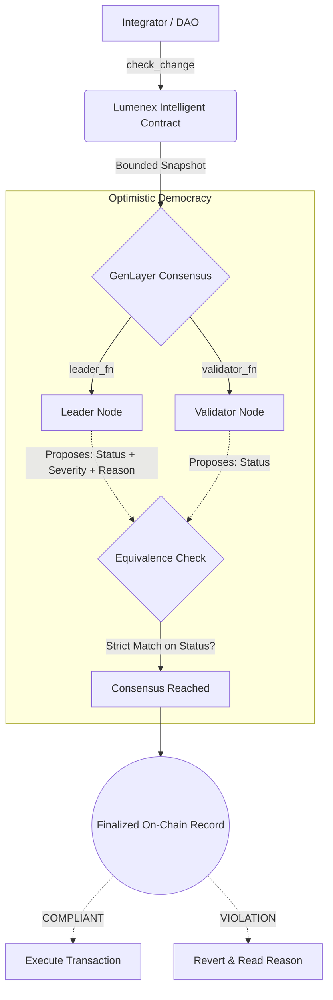

<div align="center">
  <h1>🌌 Lumenex</h1>
  <p><strong>The Advanced Semantic Policy Engine for the Agentic Economy</strong></p>

  [](https://studio.genlayer.com)
  [](https://docs.genlayer.com/understand-genlayer-protocol/core-concepts/optimistic-democracy)
  [](https://opensource.org/licenses/MIT)

  <p>
    <a href="#-the-vision">Vision</a> •
    <a href="#-key-innovations">Innovations</a> •
    <a href="#-architecture--workflow">Architecture</a> •
    <a href="#-builder-integration">Integration</a>
  </p>

  <br/>
  <h3>🟢 Live on GenLayer Studio Network</h3>
  <p>
    Contract Address: <code>0x73928A1F6Cb8aD7ba64483c9fa7BD6C9373EB3b8</code><br/>
    <a href="https://explorer-studio.genlayer.com/address/0x73928A1F6Cb8aD7ba64483c9fa7BD6C9373EB3b8">🔍 View on GenLayer Explorer</a>
  </p>
</div>

---

## 👁️ The Vision

In a rapidly scaling decentralized ecosystem, rigid mathematical smart contracts (`amount <= 100`) are no longer sufficient to govern complex DAOs, autonomous AI Agents, and dynamic protocol upgrades. 

**Lumenex** is a next-generation Intelligent Contract built natively for GenLayer. It allows builders to define on-chain governance using **plain, human-readable English** (e.g., *"No single actor may have unilateral control over treasury withdrawals"*). 

When a state change is proposed, Lumenex leverages GenLayer's large language model (LLM) consensus to definitively classify whether the proposal is `COMPLIANT` or a `VIOLATION`—bridging the gap between human intent and cryptographic execution.

---

## ✨ Key Innovations

Lumenex is not just a port of standard invariant checkers; it is a ground-up reimagining of semantic governance, pioneering three major advancements:

<dl>
  <dt>🧠 Explainable Consensus</dt>
  <dd>Lumenex does not execute "black box" rejections. Every evaluation forces the consensus nodes to generate a <strong>canonical, human-readable reason</strong> for their decision. Integrators receive immediate, actionable feedback (e.g., <em>"Violates clause 2: Unilateral withdrawal is prohibited."</em>).</dd>

  <dt>⚠️ Dynamic Risk Profiling (Severity Scoring)</dt>
  <dd>Not all policy breaches are equal. Lumenex dynamically assigns a severity score (<code>LOW</code>, <code>MEDIUM</code>, <code>HIGH</code>, <code>CRITICAL</code>) to every violation. This enables highly nuanced downstream workflows, such as automatically blocking <code>CRITICAL</code> transactions while gracefully flagging <code>LOW</code> risk events for multisig review.</dd>

  <dt>⚖️ True Equivalence-Based Validation</dt>
  <dd>Because Lumenex generates human-readable reasoning, standard identical-string matching causes validation brittleness. Lumenex pioneers an <strong>Equivalence Validation Loop</strong>. Validators run independent non-deterministic checks and assert strict equality purely on the core operational <code>status</code>, perfectly embodying GenLayer's <a href="https://docs.genlayer.com/understand-genlayer-protocol/core-concepts/optimistic-democracy/equivalence-principle">Equivalence Principle</a>.</dd>
</dl>

---

## 🏗 Architecture & Workflow

Lumenex elegantly separates deterministic state management from subjective semantic evaluation, ensuring strict bounds, tamper-evident digests, and predictable gas costs.



---

## 💻 Builder Integration

Integrating Lumenex into your autonomous workflow requires just two steps:

### 1. Register a Policy
A protocol administrator registers an immutable, human-readable rulebook.
```python
# Returns a unique inv-... identifier
invariant_set_id = lumenex.create_invariant_set(
    name="Treasury Governance",
    invariants="Withdrawals over 50 ETH require a 24-hour delay."
)
```

### 2. Request an Evaluation
When a transaction is proposed, the protocol calls Lumenex to evaluate it before execution.
```python
# Returns a finalized chk-... record
check_id = lumenex.check_change(
    invariant_set_id="inv-12345...",
    change_context="User 0xABC is attempting a withdrawal.",
    proposed_change="Immediate transfer of 100 ETH to 0xABC."
)
```
The integrating protocol can then read the `check_id` record. If the status is `VIOLATION` with a `CRITICAL` severity, the protocol automatically reverts the state change.

---

## 🚀 Deployment

Lumenex is optimized for the **GenLayer Studio Next** runtime.

### Prerequisites
- Python 3.10+
- `genvm-linter` to ensure SDK compliance

### Validation
Lumenex leverages the exact AST constraints and bounds checking required by GenVM. Verify compliance locally:
```bash
# Verify AST and GenVM determinism rules
genvm-lint lint contracts/Lumenex.py
```

### Studio Next Deployment
1. Navigate to [GenLayer Studio](https://studio.genlayer.com).
2. Create a new Intelligent Contract project.
3. Paste the contents of `contracts/Lumenex.py` and deploy.

---

